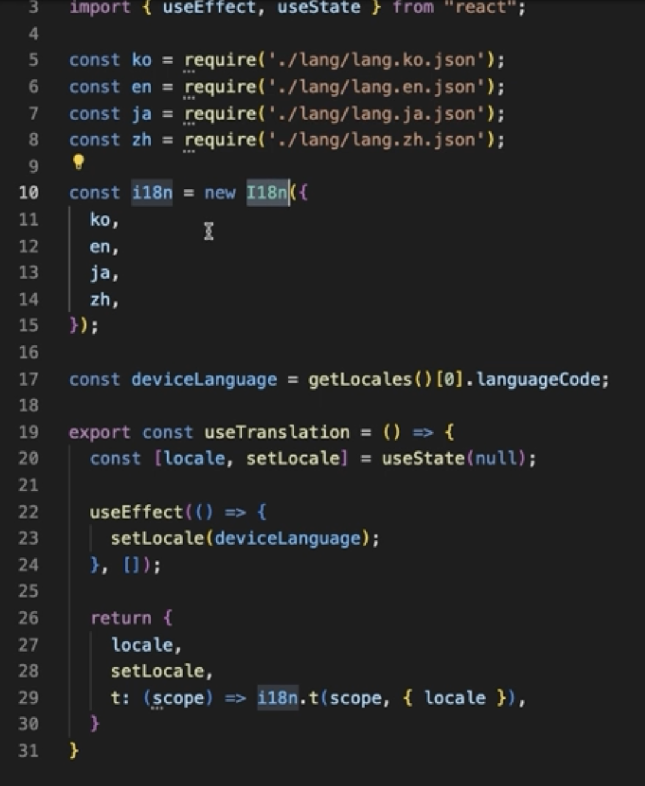

## 1. FlatList와 SectionList의 차이점!

FlatList의 경우 data를 아래와 같이 방법으로만 전달할 수 있어 분기처리하기 힘들다
```js
<FlatList 
    data={[
        {data1: 'a'}, 
        {data2: 'b'}, 
        {data3: 'c'}, 
        {data4: 'd'}, 
        {data5: 'e'}
    ]}
/>
```

SectionList의 경우 data를 다음처럼 전달할 수 있어 분기처리하기 좋다
```js
<SectionList 
    sections={[
        {
            title: 'A'
            data={[
                {data1: 'a'}, 
                {data2: 'b'}, 
                {data3: 'c'}, 
                {data4: 'd'}, 
                {data5: 'e'}
            ]}
        }, 
        {
            title: 'B'
            data={[
                {data1: 'a'}, 
                {data2: 'b'}, 
                {data3: 'c'}, 
                {data4: 'd'}, 
                {data5: 'e'}
            ]}
        }, 
        ...
    ]}
    renderSectionHeader={({title}) => <Text>{title}</Text>}
    renderItem={({item}) => <Text>{item.data1}</Text>}
/>
```
해당 data의 renderSection의 header부분은 renderSectionHeader를 통해서 추가 가능


## 2. SectionList의 refreshControl
```js
const [refreshing, setRefreshing] = useState(false)

const onRefresh = () => {
    setRefreshing(true);
}

useEffect(() => {
    if(refreshing){
        setTimeout(() => {
            // 실제 로직이라면 api refetch가 완료되는 순간 setRefreshing(false)
            setRefreshing(false)
        }, 3000)
    }
}, [refreshing])

...
<ScrollView
    refreshControl={
        <RefreshControl 
            refreshing={refreshing}
            onRefresh={onRefresh}
        />
    }
>
    <Text>Text..</Text>
</ScrollView>
```

## 3. Localization
현재 디바이스의 언어 설정을 가져올 수 있도록 도와주는 라이브러리
```
// 설치

npx expo install expo-localization
```
```js
import { getLocales } from 'expo-localization'

const i18n = new I18n({
    en: { welcome: 'Hello' },
    jp: { welcome: '곤니치와'}
}) 

const deviceLanguage = getLocales()[0].languageCode;
i18n.locale = deviceLanguage;

...
<View>
    <Text>{deviceLanguage}</Text>
    <Text>{i18n.t('welcome')}</Text>
</View>
```

: getLocales 사용하면 해당 이미지처럼 나오게 된다.


-> 해당 코드처럼 useTranslation 커스텀 훅을 만들어서 사용하면 좋다.

+ i18n.enableFallback = true;
+ i18n.defaultLanguage = 'ko';
위 두가지를 설정해주면 i18n.enableFallback = true; 설정으로 현재 해당하는 값이 없을 때 default값으로 fallback 해줄건지를 선택할 수 있다.
true로 설정해줬을 경우 i18n.defaultLanguage를 사용해서 초기 값을 설정해준다!


## 4. SplashScreen
: SplashScreen은 애플리케이션이 로드될 때 사용자가 보는 초기 화면이다 SplashScreen를 직접 설정하는 방법을 알아보자
### 1) SplashScreen 설치
```
npx expo install expo-splash-screen
```

### 2) 자동으로 SplashScreen이 지워지는 걸 막아주기
```js
import * as SplashScreen from 'expo-splash-screen'
...

SplashScreen.preventAutoHideAsync();
```

### 3) 이후 SplashScreen이 없어지는 경우를 직접 세팅해준다.
```js
useEffect(() => {
    setTimeout(() => {
        SplashScreen.hideAsync();
    }, 2000)
}, [])
```

### 4) SplashScreen 이미지를 직접 만들어보자!
: Figma를 이용해서 제작 <br/>
 -> expo에서 제공하는 figma template를 다운받아서 figma에서 그대로 복사 후 실행 <br/>
 -> 이후 템플릿 규격대로 만들어진 image를 figma에서 export한 후 splash.png 파일로 assets에 등록하면 완료! <br/>

### 5) SplashScreen의 좋은 사용법 -> Lottie
: SplashScreen은 필수적인 요소가 다 준비가 되면 얼른 닫고 그 다음에 로드되는 데이터들이 있으면 추가적으로 로딩 화면을 보여주는 게 더 이상적이다

**Lottie**는 움직이는 애니메이션을 코드로 변환해주기 때문에 벡터 이미지처럼 사이즈 변경에 손실이 없다는 장점이 있다!

[LottieFiles](https://lottiefiles.com/kr/) : 원하는 애니메이션을 다운로드하고 편집하여 개인 및 상업 프로젝트에서 저작권 걱정 없이 언제든 사용할 수 있는 사이트
<br/>
**해당 사이트에서 로딩 이미지를 json 파일로 다운로드 후 적용하면 됨**

#### Lottie 적용 순서
설치
```
npx expo install lottie-react-native
```
코드 예시
```js
import LottieView from 'lottie-react-native'

export default const Loading = () => {
    //ref 설정을 통해 play 시간을 직접 조절할 수 있다.
    const ref = useRef(null)

    return (
        <View 
            style={{flex: 1, justifyContent: "center", alignItems: "center"}}
        >
            <LottieView 
                ref={ref}
                // 자동 play 여부
                autoPlay
                // 주석으로 해당 이미지의 주소를 알려줘도 좋음
                source={require('./assets/loading.json')}
                style={{width: 150}}
            />
        </View>
    )
}

```

