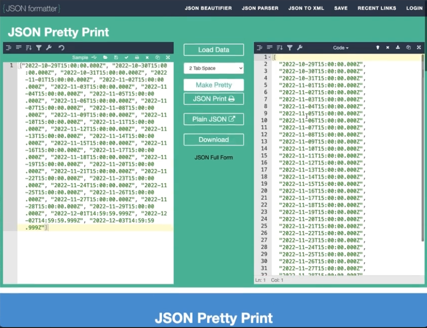
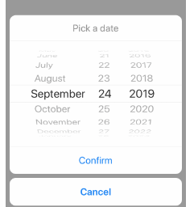

### 개발 환경에서만 보이도록하는 로직 
```js
{__DEV__ && (
    <>
        <Text>{input}</Text>
    </>
)}

//__DEV__를 사용하면 현재 개발상태인지 true, false로 볼 수 있다.
```

### 달력 기능 or 날짜 기능 사용시 dayjs
: moment.js는 현재 업데이트가 없고 번들사이즈도 크기 때문에 dayjs 사용을 권장함

```js
npm install dayjs --save
```
[dayjs 공식 docs 홈페이지](https://day.js.org/en/)


### JSON 데이터를 이쁘게 보이게 해주는 사이트 알아두기


[JSON 파일을 예쁘게 변경해주는 사이트](https://jsonformatter.org/json-pretty-print)


 ### react-native-modal-datetime-picker


안드로이드 or iOS용 데이트피커 라이브러리 추천

[react-native-modal-datetime-picker](https://www.npmjs.com/package/react-native-modal-datetime-picker)


### RN에서 onClick은 onPress!!

### RN에서 사용하면 좋은 라이브러리 react-native-iphone-x-helper
- getStatusBarHeight => 아이콘의 상단 바 높이를 가져올 수 있음
- getBottomSpace => 아이콘의 하단 공간 높이를 가져올 수 있음

```js

import { getStatusBarHeight, getBottomSpace } from 'react-native-iphone-x-helper'

const statusBarHeight = getStatusBarHeight();
const bottomSpace = getBottomSpace();

```

### Input 클릭시 키보드가 올라왔을 경우 UI 대처방법
1. ios 시뮬레이터에서 키보드를 켜준다 
: cmd + shift + k 단축키로 가능
2. KeyboardAvoidingView 로 키보드가 올라왔을 때 같이 올라갈 부분에 감싸준다.
3. behavior={Platform.OS === "ios" ? "padding" : "height"} 속성을 적용해준다
```js
<KeyboardAvoidingView
    behavior={Platform.OS === "ios" ? "padding" : "height"}
>
    <>
        <FlatList ... />
        <AddTodoInput ... />
    </>
</KeyboardAvoidingView>
```

### TouchableOpacity 와 Pressable의 차이점
Pressable은 클릭했을 때 opacity가 1이고 TouchableOpacity는 클릭했을 때 opacity가 0이 됨
```js
<TouchableOpacity activeOpacity={1}>
    ...
</TouchableOpacity>

<Pressable>
    ...
</Pressable>

위 두가지 경우가 같아지기 때문에 activeOpacity가 1인 TouchableOpacity 대신 Pressable을 사용하면 좋다
```

전역으로 키보드 바깥을 클릭했을 때 키보드가 내려가도록 하고싶다면 아래 코드처럼 onPress에 Keyboard.dismiss 설정
```js
// 전역 위치에 Pressable로 감싸지도록 변경
    <Pressable
        style={styles.container}
        onPress={Keyboard.dismiss}
    >
        ...
    </Pressable>
```
- KeyboardAvoidingView 안쪽은 따로 설정해주지 않아도 자동으로 적용된다.