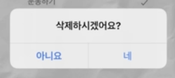

### 개발 환경에서만 보이도록하는 로직 
```js
{__DEV__ && (
    <>
        <Text>{input}</Text>
    </>
)}

//__DEV__를 사용하면 현재 개발상태인지 true, false로 볼 수 있다..
```

### 달력 기능 or 날짜 기능 사용시 dayjs
: moment.js는 현재 업데이트가 없고 번들사이즈도 크기 때문에 dayjs 사용을 권장함

```js
npm install dayjs --save
```
[dayjs 공식 docs 홈페이지](https://day.js.org/en/)


### JSON 데이터를 이쁘게 보이게 해주는 사이트 알아두기


[JSON 파일을 예쁘게 변경해주는 사이트](https://jsonformatter.org/json-pretty-print)


 ### react-native-modal-datetime-picker


안드로이드 or iOS용 데이트피커 라이브러리 추천

[react-native-modal-datetime-picker](https://www.npmjs.com/package/react-native-modal-datetime-picker)


### RN에서 onClick은 onPress!!

### RN에서 사용하면 좋은 라이브러리 react-native-iphone-x-helper
- getStatusBarHeight => 아이콘의 상단 바 높이를 가져올 수 있음
- getBottomSpace => 아이콘의 하단 공간 높이를 가져올 수 있음

```js

import { getStatusBarHeight, getBottomSpace } from 'react-native-iphone-x-helper'

const statusBarHeight = getStatusBarHeight();
const bottomSpace = getBottomSpace();

```

### Input 클릭시 키보드가 올라왔을 경우 UI 대처방법
1. ios 시뮬레이터에서 키보드를 켜준다 
: cmd + shift + k 단축키로 가능
2. KeyboardAvoidingView 로 키보드가 올라왔을 때 같이 올라갈 부분에 감싸준다.
3. behavior={Platform.OS === "ios" ? "padding" : "height"} 속성을 적용해준다
```js
<KeyboardAvoidingView
    behavior={Platform.OS === "ios" ? "padding" : "height"}
>
    <>
        <FlatList ... />
        <AddTodoInput ... />
    </>
</KeyboardAvoidingView>
```

### TouchableOpacity 와 Pressable의 차이점
Pressable은 클릭했을 때 opacity가 1이고 TouchableOpacity는 클릭했을 때 opacity가 0이 됨
```js
<TouchableOpacity activeOpacity={1}>
    ...
</TouchableOpacity>

<Pressable>
    ...
</Pressable>

위 두가지 경우가 같아지기 때문에 activeOpacity가 1인 TouchableOpacity 대신 Pressable을 사용하면 좋다
```

전역으로 키보드 바깥을 클릭했을 때 키보드가 내려가도록 하고싶다면 아래 코드처럼 onPress에 Keyboard.dismiss 설정
```js
// 전역 위치에 Pressable로 감싸지도록 변경
    <Pressable
        style={styles.container}
        onPress={Keyboard.dismiss}
        onLongPress={onLongPress}
    >
        ...
    </Pressable>
```
- KeyboardAvoidingView 안쪽은 따로 설정해주지 않아도 자동으로 적용된다.
- onLongPress는 프레스 가능한 영역을 길게 눌렀을 때의 이벤트를 설정할 수 있다.


### 앱에서 alert 설정 방법

```js

const onLongPress = () => {
    Alert.alert(
        "삭제하시겠어요?(Alert의 타이틀)", 
        "(Alert의 description)", 
        [
            {
                style: "cancel",
                text: "아니요"
            }, 
            {
                text: "네",
                onPress: () => { remove.todo(todo.id); }
            }
        ]
    )
}

```

### TextInput의 작성이 종료됬을 경우 onSubmitEditing으로 이벤트 전달 가능
```js
<TextInput 
    ...
    onSubmitEditing={onSubmitEditing}
/>
```

### TextInput의 submit 이벤트 이후 키보드가 내려가는 설정을 blurOnSubmit 설정으로 방지할 수 있다.
```js
<TextInput 
    ...
    onSubmitEditing={onSubmitEditing}
    blurOnSubmit={false}
/>
```

### TextInput의 텍스트 작성이 포커스가 되었을 때 스크롤을 가장 하위로 이동시켜 사용성을 높여보자
```js
const onFocus = () => {
    setTimeout(() => {
        flatListRef.current?.scrollToEnd();
    }, 100)
}


<TextInput 
    ...
    onSubmitEditing={onSubmitEditing}
    blurOnSubmit={false}
    onFocus={onFocus}
/>
```

### TextInput의 autoFocus 설정으로 쉽게 오토포커스 기능 적용
```js

<TextInput 
    ...
    autoFocus={true}
/>
```

### 앱을 삭제하지 않는 한 앱을 종료했다 다시 실행을 해도 그 값을 기억하는 가능하게 해주는 AsyncStorage

[AsyncStorage RN docs](https://reactnative.dev/docs/asyncstorage)

[AsyncStorage expo docs](https://docs.expo.dev/versions/latest/sdk/async-storage/)

```
// expo 사용시 설치 필요

npx expo install @react-native-async-storage/async-storage
```

- 적용 예시 코드
```js
import AsyncStorage from '@react-native-async-storage/async-storage'

const TODO_LIST_KEY = "TODO_LIST_KEY"

const addTodo = () => {
    const length = todoList.length;
    const lastId = length === 0 ? 0 : todoList[length - 1].id;

    const newTodoList = [
        ...todoList,
        {
            id: lastId + 1,
            content: input,
            date: selectedDate,
            isSuccess: false,
        }
    ]
    setTodoList(newTodoList)
    AsyncStorage.setItem(TODO_LIST_KEY, JSON.stringify(newTodoList))
}

useEffect(() => {
    init();
}, [])

const init = async () => {
    const result = await AsyncStorage.getItem(TODO_LIST_KEY);
    if (result) {
        setTodoList(JSON.parse(result))
    }
}
```
: AsyncStorage의 value 값으로는 string 값만 가능하기 때문에 JSON.stringify를 사용해서 객체 형태의 데이터를 변경해서 저장해줄 수 있다.
또한 다시 값을 가져와서 사용할 때는 JSON.parse 메서드로 원래 형태의 데이터로 사용해주면 된다.

