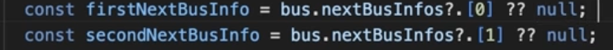
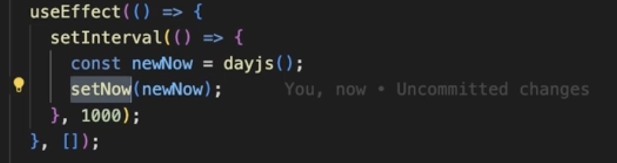
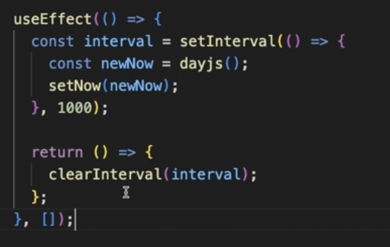

## 1. ?? 연산자 사용

: 앞에 값이 존재하지 않을 경우 ?? 연산자를 통해 뒤에 올 값으로 대체되도록 한다
```js
undefined ?? null // -> null
{ ... } ?? null // -> { ... }
```

## 2. setInterval 사용

: 다음 인자로 오는 초만큼 반복해서 실행시켜줄 수 있는 메서드
- 주의사항

위 이미지처럼 setInterval의 반환값을 변수에 설정하고 useEffect가 언마운트될 때 **return () => { clearInterval(변수) }** 로직을 꼭 넣어줘야함

