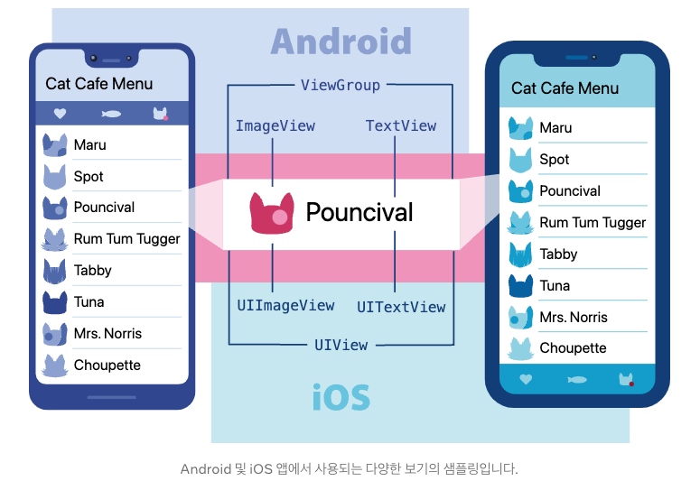
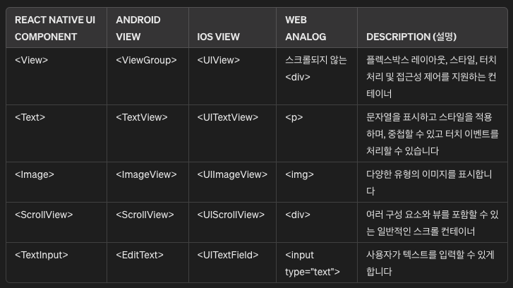

## React Native에서 자주 쓰이는 Core Components

React Native는 React와 앱 플랫폼의 기본 기능을 사용하여 Android 및 iOS 애플리케이션을 구축하기 위한 오픈소스 프레임워크이다.
React Native를 사용하면 JavaScript를 사용하여 플랫폼의 API에 액세스하고 React 구성 요소(재사용 가능하고 중첩 가능한 코드 묶음)를 사용하여 UI 모양과 동작을 설명한다. 

### 뷰 및 모바일
Android 및 iOS 개발에서 뷰는 UI의 기본 구성 요소이다. 즉, 텍스트나 이미지를 표시하거나 사용자 입력에 응닿바는 데 사용할 수 있는 화면의 작은 직사각형 요소를 말한다.

텍스트 줄이나 버튼과 같은 앱의 가장 작은 시각적 요소도 일종의 뷰이다.




### 기본
React Native 구성 요소는 Android 및 iOS와 동일한 보기로 지원되므로 React Native 앱은 다른 앱과 마찬가지로 성능이 동일하다. 

React Native에는 지금 바로 앱 구축을 시작하는 데 사용할 수 있는 필수적이고 바로 사용할 수 있는 기본 구성 요소 세트가 있다.
> 그것을 React Native의 핵심 구성 요소라고 한다.

### 핵심
React Native에는 컨트롤부터 활동 표시기까지 모든 것에 대한 많은 핵심 구성 요소가 있다. API 섹션에서 모두 문서화되어 있는 것을 찾을 수 있다. 
주로 다음 핵심 구성 요소를 사용하여 작업하게 된다.



<br/>


### 터치가 가능해야하는 공간의 경우 TouchableOpacity
```js
<TouchableOpacity 
    onPress={props.onPress} 
    activeOpacity={1}
    hitSlop={{ top: 15, bottom: 15 }}
>
    ...
</TouchableOpacity>
```
- 클릭했을 때 opacity를 주고싶지 않다면 activeOpacity를 1로 주면된다.
- TouchableOpacity의 css 공간을 건드리지 않으면서 터치 가능한 공간만 넓히고 싶다면 hitSlop 속성을 사용하면된다.
<br/>


### 스크롤 되는 부분의 경우 ScrollView 
```js
const bottomSpace = getBottomSpace();

<ScrollView 
    showVerticalScrollIndicator={false} 
    contentContainerStyle={{ paddingBottom: bottomSpace }}
>
    ...
</ScrollView>
```
- "showVerticalScrollIndicator={false}"로 설정하면 스크롤바를 사라지게할수 있음
- const bottomSpace = getBottomSpace();를 통해서 bottomSpace를 가져올 수 있음

<br/>

### 데이터가 많을 경우 ScrollView보다 FlatList 사용하기!
ScrollView보다 FlatList가 데이터가 많을 경우 성능이 더 좋다
```js
const ItemSeparatorComponent = () => <Margin height={13} />
const renderItem = ({ item }) => (
    <View>
        <Profile 
            uri={item.uri}
            name={item.name}
            introduction={item.introduction}
        />
        <Margin height={13}>
    </View>
) 
const ListHeaderComponent = () => (
    <View>
        ...Header로 보여질 요소들
    </View>
)
const ListFooterComponent = () => (
    <TabBar selectedTabIdx={selectedTabIdx} setSelectedTabIdx={setSelectedTabIdx} />
)

<View>
    <FlatList
        data={isOpened ? listData : []}
        keyExtractor={(_, index) => index}
        stickHeaderIndices={[0]}
        ItemSeparatorComponent={ItemSeparatorComponent}
        renderItem={renderItem}
        ListHeaderComponent={ListHeaderComponent}
        ListFooterComponent={ListFooterComponent}
        numColumns={7}
    />
</View>
```
- data에 renderItem에 map으로 전달할 데이터를 전
- keyExtractor에는 key로 전달할 값을 전달할 수 있다 index도 가능하고 data의 특정 값도 가능하다! 
- ItemSeparatorComponent는 반복되어 보여질 renderItem 사이사이에 보여줄 컴포넌트를 전달하면 된다. margin에 대한 컴포넌트를 전달하기도 한다.
- ListHeaderComponent는 해당 FlatList의 헤더 부분에 보여질 컴포넌트를 전달할 수 있다.
    - 만약 ListHeaderComponent를 고정하고 싶다면 stickHeaderIndices={[0]} 속성을 전달하면 된다.
    - 전달하는 index값은 고정할 헤더의 index값을 넣어주면 된다.
- ListFooterComponent는 해당 FlatList의 푸터 부분에 보여질 컴포넌트를 전달할 수 있다.
- renderItem은 data로 반복해서 보여질 UI요소를 지정해 전달한다
- numColumns로 column에 보여줄 data의 개수도 설정할 수 있다.

- **data={isOpened ? listData : []}** 이런 방식으로 FlatList 데이터를 보여주고 안보여주는 기능을 생각해볼 수 있다.

<br/>

### 안전한 영역을 지정할 수 있는 SafeAreaView

```js

<SafeAreaView>
    <Calculator />
</SafeAreaView>

```
- SafeAreaView는 장치의 안전 영역 경계 내에서 콘텐츠가 렌더링되도록 보장한다. 
- 안전하지 않은 영역을 자동으로 처리하여, 콘텐츠가 노치나 상태 바, 홈 인티케이터 등에 가려질 수 있는 화면 영역을 처리하는 방식에서 View와 차이가 있다.


<br/>

### 외부 컨테이너 스타일과 내부 콘텐츠 스타일 적용

1. **외부 컨테이너 스타일 (style):**

    ScrollView의 외부 컨테이너에 적용된다.
    ScrollView 자체의 크기, 배경색, 테두리 등을 설정하는 데 사용된다.
    ScrollView가 스크롤 영역을 차지하는 방식을 제어한다.

2. **내부 콘텐츠 스타일 (contentContainerStyle)**:

    ScrollView 내부의 콘텐츠 컨테이너에 적용된다.
    스크롤 가능한 콘텐츠의 레이아웃을 설정하는 데 사용된다.
    콘텐츠의 패딩, 마진, 배경색, 정렬 등을 설정할 수 있다.

<br/>

### paddingHorizontal 이란?
: paddingHorizontal은 React Native 에서 사용되는 스타일 속성으로, 요소의 좌우에 동일한 크기의 패딩을 적용할 때 사용된다. 이 속성은 CSS의 padding-right와 padding-left를 한번에 설정할 수 있도록 도와준다.

### paddingVertical 이란?
: paddingVertical은 React Native에서 사용되는 스타일 속성으로, 요소의 위아래에 동일한 크기의 패딩을 적용할 때 사용된다. 이 속성은 CSS의 padding-top과 padding-bottom을 한번에 설정할 수 있도록 도와준다.

### borderTopWidth, borderBottomWidth, borderTopColor, borderBottomColor 스타일도 존재한다!


